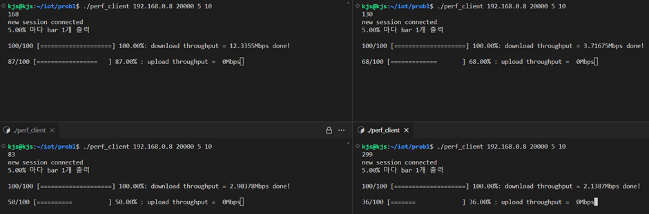
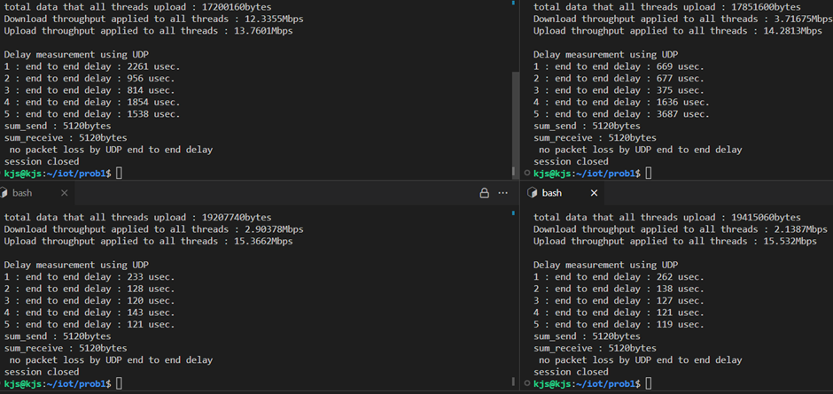

# Internet_Quality_Measurement_Project

- This program is an internet speed measurement program made with Boost Library based on cpp. 

- [Boost.Asio Overview](https://www.boost.org/doc/libs/1_81_0/doc/html/boost_asio/overview.html)

- A terminal program was produced using the NIA Internet quality measurement program as a model.

- [NIA](https://speed.nia.or.kr/index.asp)

- Ubuntu(Linux) environment is required. 

- Installation required : `g++(std=c++11)`, `cmake`
```
kho@kho-desktop:~/cpp$ cmake -version
cmake version 3.28.1

CMake suite maintained and supported by Kitware (kitware.com/cmake).
```

- [boost_1_81_0.tar.gz download](https://boostorg.jfrog.io/artifactory/main/release/1.81.0/source/boost_1_81_0.tar.gz)

- use cmake to build project

- When a client connects to the server, Download Throughput(TCP), Upload Throughput(TCP) and End-to-End 
Delay(UDP) will be measured

- The client can directly specify the internet speed measurement time and the number of TCP sessions connected to the server as command line arguments.

- To measure maximum throughput, you can set the number of TCP sessions connected to the server higher. 

- One thread per session handles the work.

- A server can support multiple clients simultaneously.  

- When running multiple clients and server in one environment, bind errors due to overlapping port numbers can occur occasionally. If so, close all programs(ctrl + c) and restart.


```
mkdir build && cd build 
cmake .. 
nproc # 자신 시스템의 코어 수 확인

# build (modify the core number '12' after option -j accordingly)
make -j4 # 자신 시스템 코어 수에 맞게 -j 다음의 숫자를 변경
cd bin
```


```
./perf_client <IP> <port> <the number of session> <measure time>
```

```
./perf_server <port>
```





